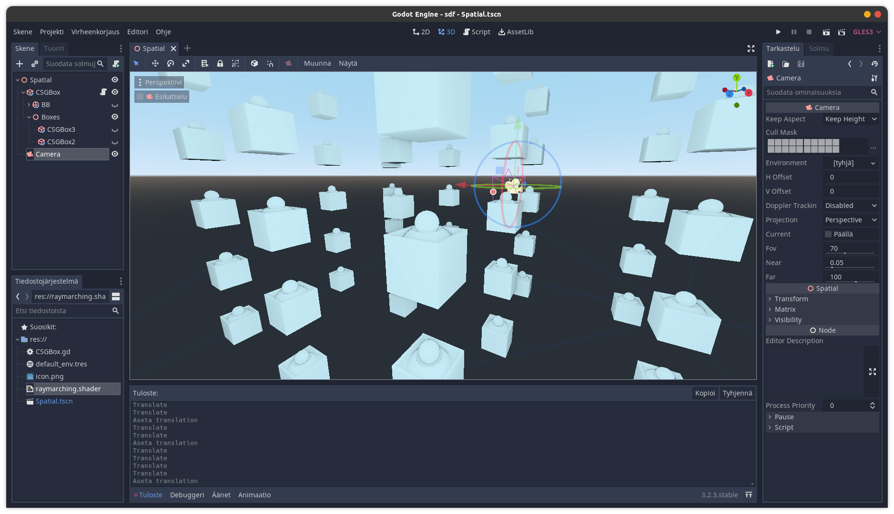

# Godot-SDF (Iteration 3?)
Now based on https://godotshaders.com/shader/raymarch-in-a-box/

# Purpose
This project is mainly a way for me to get my hands wet in sdfs and shader design. I do not advice you to use any of the code anywhere, but to instead watch an actual tutorial or course about this subject (I did neither).

# Screenshots


# Usage Instructions
If you want to experiement with this shader in your own projects, just follow the following instructions:

1. Create a cube in the scene, it can be of any kind, a meshinstance, CSGBox, doesn't matter.
2. Add a shadermaterial for it.
3. Assign the shadermaterial's shader to be the "raymarching.shader" found in this folder.
4. Now take a look at the shader params. Godot doesn't currently support using arrays as params, so the slots are hardcoded. The slots for spheres start with "s" and the slots for boxes start with "b". The slots ending with "s" indicate scale and the slots ending with "b" indicate the boolean operation of the given slot.
5. The slot-system will be a pain to work with, but atleast it is easy to update from code using ```material.set_shader_param("[shape (s/b)]" + str(slotIndex) + "booleanOperation/scale/blank for position", value eg. Vector3(1, 1, 1) )```
6. Have fun where possible, you can message me for advice but I am not a professional so my advice could end up really not being helpful.
